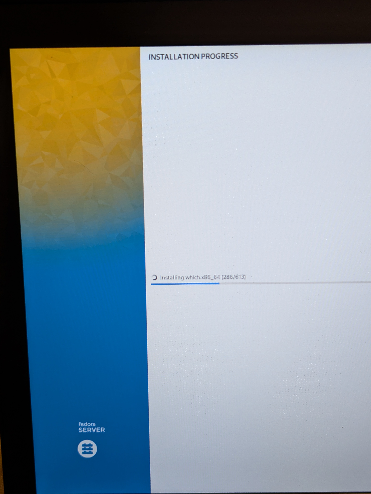

+++
date = '2025-09-05T21:15:41-04:00'
draft = false
title = 'Self Hosting Journey'
+++
> Disclaimer: This post is not a how-to guide. I'll share my experience and my setup so that you can get an idea of what can be done. I’ve added links to the services I mention, in case you want to read more about them.

I knew about self-hosting but only the 'self-hosted media' part of it. I knew about Plex and Jellyfin, and that people set them up on a NAS. I never truly understood servers. My idea of servers was a big rack with a bunch of hardware and wires running through all of them. I had watched videos of LTT building servers with 100+ cores, 1 PB+ storage. It seemed like something that only companies build.

## Introduction
My self-hosting journey began when I got to know the extent of tracking that we are subject to by the services we use. I stumbled upon Louis Rossman's YouTube channel. In a [video](https://youtu.be/CE0EB5bXj14) he was talking about how a Software Engineer had to suffer because the Google Photos algorithm mis-flagged some pictures. That was horrifying and now, I was looking for a way to replace my Google Photos, mainly for better privacy and security. While searching for alternatives, I discovered [Immich](https://github.com/immich-app/immich). I went to look for people's views on reddit and I discovered [r/selfhosted](https://www.reddit.com/r/selfhosted), [r/HomeServer](https://www.reddit.com/r/HomeServer) and [r/homelab](https://www.reddit.com/r/homelab). Seeing people's setup, I realized that any computer can be a server. I saw people hosting their stuff on [Raspberry Pi](https://www.raspberrypi.com/). I have a lot of photos and I was storing all the photos only on my computer's hard drive. I wanted access to all my photos and uploading all of it on Google Photos would have increased my monthly subscription cost. Immich offered everything I was looking for.

## My Setup Details
### Hardware
I wanted the cost to be minimum but also good enough to not worry about insufficient resources. I bought a refurbished Lenovo Thinkpad T480 with these specs for around $300 CAD (~ $215 USD) from Amazon.

| Hardware | Specs                        |
| -------- | ---------------------------- |
| CPU      | Intel Core i5 8350U (8 core) |
| Ram      | 16 GB                        |
| Storage  | 256 GB                       |
| Screen   | 14" FHD                      |

It stays connected to my modem via LAN. I am running it headless and I haven’t detached the battery or screen.

### Operating System
Initially I chose [Fedora Server Edition](https://fedoraproject.org/en/server/) because I was already daily driving [Fedora workstation edition](https://fedoraproject.org/workstation/) on my PC and I loved it. Fedora server also had a GUI for installation and [cockpit](https://cockpit-project.org/) for management, which made things a lot easier.




Then I faced some issues with certain apps on Fedora and I decided to switch to Ubuntu. I installed Ubuntu and I was facing a lot more issues but with the hardware this time. Then I got to know about [Proxmox](https://www.proxmox.com/en/) and installed that. Best decision I ever made. 


Since then, here’s how I’ve set things up.


### Current System
I am running one [Ubuntu Server](https://ubuntu.com/server) VM and one [LXC container](https://linuxcontainers.org/lxc/introduction/) for VPN. All applications are running in docker containers. No ports are exposed, apart from a few exceptions. Networking is done through docker and everything is exposed only through [nginx](https://nginx.org/en/). For remote access, I use VPN. I was using plain old [Wireguard](https://www.wireguard.com/) when I had Fedora and had exposed a port on the modem. But later on, something broke, it stopped working, I gave up fixing it and moved on to [Tailscale](https://tailscale.com/). Tailscale just works and I didn't even have to open a port this time. I'm running it in the LXC container that I wrote about earlier.

I wanted to share my Immich setup with my family but I didn't want them to deal with VPNs. I wanted something like [Cloudflare tunnels](https://developers.cloudflare.com/cloudflare-one/connections/connect-networks/) but it had an upload limit of 100MB. Even on its paid tiers, there's upload limit up to 200MB. I was looking for alternatives and I found [Pangolin](https://github.com/fosrl/pangolin). I bought a cheap VPS for $11.29 CAD/year (~ $8.14 USD/year) from [Racknerd](https://racknerd.com/) for Pangolin and my setup was complete. I was able to give 200GB to each family member for free and it works like any other app.

### Backups
For backups, I am using [restic](https://github.com/restic/restic). The backups are encrypted, compressed and have snapshots, thanks to its built-in de-duplication capability. I have one local and one offshore backup. I have configured restic using [backrest](https://github.com/garethgeorge/backrest) to do daily full backups to an external SSD and daily backups of just the important data to a [Backblaze B2](https://www.backblaze.com/cloud-storage) bucket. Backblaze costs me around $1.50 CAD/month (~ $1.10 USD/month).

## Future Plans
My current setup is actually not the way I want it to be, there are some flaws and things I want to improve.
1. **Storage**: The biggest flaw that I want to change first in my current setup is storage. A big chunk of my storage is allotted to the VM directly, I cannot resize it easily. I want to setup [TruNas](https://www.truenas.com/) with maybe [NFS](https://learn.microsoft.com/en-us/windows-server/storage/nfs/nfs-overview), [SMB](https://en.wikipedia.org/wiki/Server_Message_Block) or something better instead. I also want more storage with a good RAID setup.
2. **Better remote access**: I want to move on from Tailscale simply because I don't want to trust any company with my data. I have been using it because of its convenience and reliability. I love it but I found something that fits me better. I want to self-host [netbird](https://netbird.io/) on a VPS.
3. **Better Portability**: I want to setup config files to take my setup anywhere. Maybe I'll go with NixOS or something similar.
4. **Clustering**: I want High Availability services. I am looking into setting up a Proxmox cluster or a Kubernetes cluster.
5. **Better backups**: I want to setup a local [Proxmox Backup Server](https://www.proxmox.com/en/products/proxmox-backup-server/overview) and maybe an encrypted daily backup of my server at my parents' house over VPN and SSH.

## Current Hosted Services

Here’s my dashboard of hosted services:


## Why it's worth it

I would definitely recommend self-hosting to everyone. It may seem intimidating but it's very rewarding and it helps you learn and understand a lot about networking. Honestly, it's a lot easier now thanks to [containerization](https://aws.amazon.com/what-is/containerization/). If it wasn't as easy as running `docker run app-name` or `docker compose up -d` to start an application, I wouldn't be running most of my applications. For example, to have your own private suite of [IT tools](https://it-tools.tech/) you just need docker installed and a file named `docker-compose.yml` with these contents:

```yml
version: '3'
services:
  it-tools:
    image: corentinth/it-tools
    container_name: it-tools
    ports:
      - "8080:80"
    restart: unless-stopped
```

After this, just open a terminal in the folder where you've kept the file and run:

```bash
docker compose up -d
```

Now open a browser and go to **http://localhost:8080**. That's all!

Now it is easier than ever to setup a server and I think everybody should have one of their own. Anyone can start with a simple laptop. If I could, so can you.